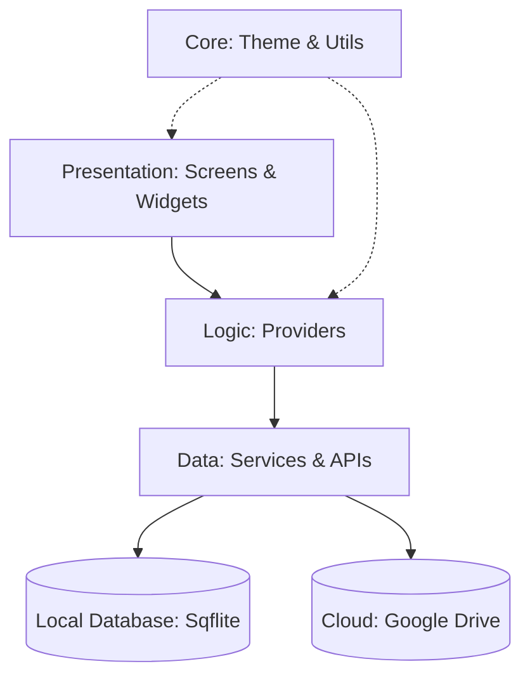

# DOCUMENTATION - OverTime Project

## 1. Overview
OverTime is a professional-grade Flutter application designed for personal work-time tracking, salary estimation, financial management (Cash Flow & Debt), and multifaceted citizen lookups. It features robust data security with local authentication and cloud backup integration via Google Drive.

## 2. Architecture Overview
The project follows a modified Layered Architecture to ensure separation of concerns and maintainability:

- **Presentation Layer (`lib/presentation`)**: Contains all UI components (Screens and Shared Widgets). It interacts with the Logic layer via `Provider`.
- **Logic Layer (`lib/logic`)**: Manages the application state using the `Provider` pattern.
- **Data Layer (`lib/data`)**: Responsible for data persistence (Sqflite), external API interactions, and business services.
- **Core Layer (`lib/core`)**: Contains cross-cutting concerns like themes, constants, and utilities.

## 3. Functional Modules

### 3.1 Overtime & Salary Management
- **Models**: `OvertimeEntry`, `OTTemplate`
- **Logic**: `OvertimeProvider`
- **Features**: 
    - Real-time salary calculation with custom coefficients (1.5x, 1.8x, 2.0x).
    - Quick templates for frequent work shifts.
    - Detailed statistics and PDF/Excel export.

### 3.2 Cash Flow & Projects
- **Models**: `CashTransaction`
- **Logic**: `CashTransactionProvider`
- **Features**: 
    - Track income and expenses categorized by projects.
    - Balance monitoring across multiple funds.

### 3.3 Debt & Interest Tracking
- **Models**: `DebtEntry`
- **Logic**: `DebtProvider`
- **Features**: 
    - Manage personal debts and loans.
    - Automated interest rate calculation and payment tracking.

### 3.4 Citizen Search Hub
- **Features**:
    - **Traffic Fines**: Look up vehicle violations.
    - **Social Insurance (BHXH)**: Check insurance history and contributions.
    - **Tax ID (MST)**: Personal and business tax identification lookup.
    - **Fuel & Gold Prices**: Real-time commodity price tracking.

## 4. Technical Services

### 4.1 Data Persistence
Managed by `StorageService`, utilizing `Sqflite` for local SQL storage. Supporting complex queries for statistics and history.

### 4.2 Cloud Backup & Google Integration
- **AuthService**: Handles Google Sign-In with silent authentication.
- **BackupService**: Synchronizes local database with Google Drive.
- **GoogleSheetsService**: (Legacy/Extended) Support for exporting data directly to Sheets.

### 4.3 Background Processing
Uses `Workmanager` (`BackgroundService`) to perform periodic tasks like checking for updates or processing scheduled notifications.

### 4.4 Reporting
`ExcelService` provides high-fidelity Excel exports using specific fonts (Times New Roman) and professional formatting for accounting purposes.

## 5. Directory Structure Detail

### [`lib/core`](file:///d:/Project/%202025/OverTime_Master/lib/core)
Common utilities, theme definitions (`AppTheme`), and application-wide constants.

### [`lib/data`](file:///d:/Project/%202025/OverTime_Master/lib/data)
- **models**: Data entity definitions.
- **services**: Business logic implementations and external integrations.

### [`lib/logic`](file:///d:/Project/%202025/OverTime_Master/lib/logic)
State management layer. Each provider handles a specific domain of the app (e.g., `OvertimeProvider` for OT shifts).

### [`lib/presentation`](file:///d:/Project/%202025/OverTime_Master/lib/presentation)
- **screens**: Individual application pages.
- **widgets**: Reusable UI components.

## 6. Development Tools
The project includes several automation scripts in the [`tool`](file:///d:/Project/%202025/OverTime_Master/tool) directory for deployment, metadata management, and token generation.
